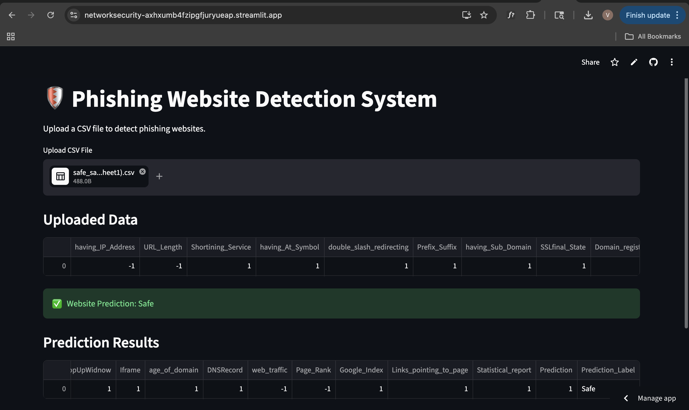
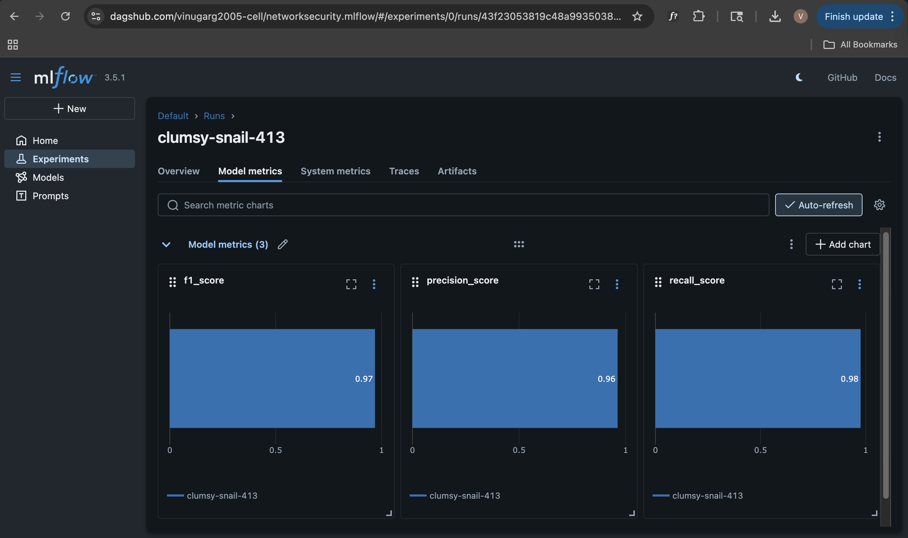
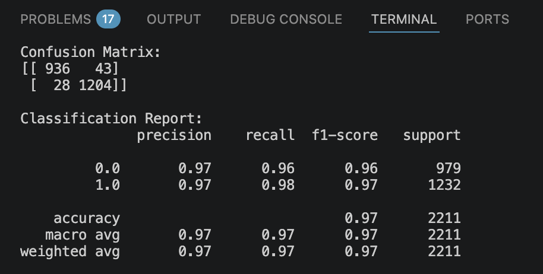

# Phishing Website Detection System
An end-to-end Machine Learning project that detects phishing websites using feature-based classification. The project includes data pipelines, model training, experiment tracking with MLflow, and deployment using Streamlit.

## Features
- End-to-end ML pipeline
- Data ingestion from MongoDB
- Data validation & transformation
- Model training using Scikit-learn
- MLflow + DagsHub experiment tracking
- Streamlit deployment
- Dockerized setup
- Real-time CSV prediction

## Tech Stack
- Python
- Scikit-learn
- Pandas
- MongoDB
- MLflow
- DagsHub
- Streamlit
- Docker

## Workflow
Data Ingestion → Data Validation → Data Transformation → Model Training → MLflow Tracking → Streamlit Deployment

## Screenshots

### Streamlit App

### MLflow Metrics

### Confusion Matrix

